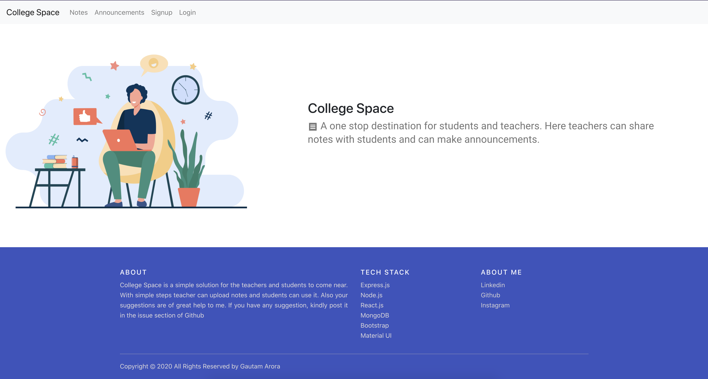
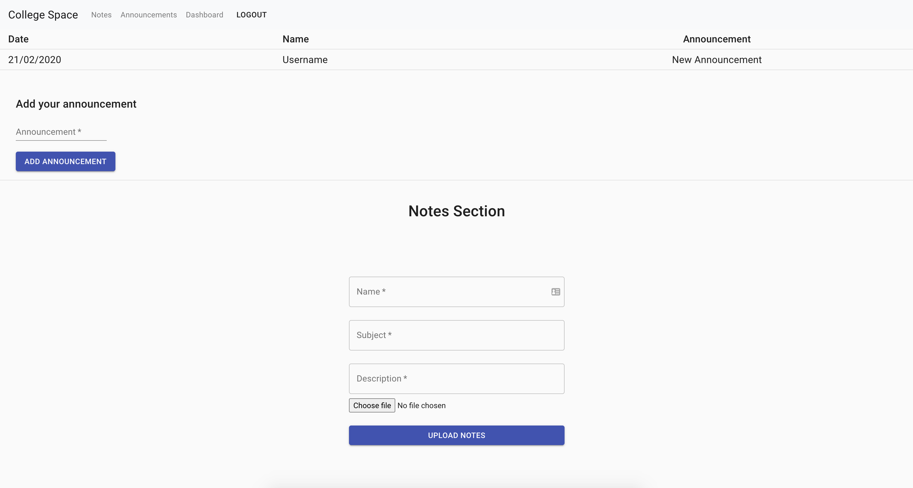
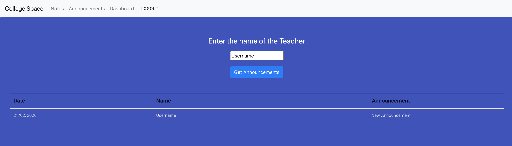

# College Space

  

**_Installation_**
1) Firstly, clone the repository: `git clone https://github.com/Gautam-Arora24/College-Space.git`
2) Navigate to the directory and run `npm install` for your backend dependencies.
3) Run `npm run install-client` to install the front-end dependencies.
4) Rename `.env.example` to `.env` and populate the keys with the relevant information.

**_Usage_**
- To run the backend server locally, run: `npm start`
- To run the front-end app locally, navigate to `/client` and run `npm start`

**_What is College Space?_**
- A MERN Web App where teachers and students can connect with each other. 
- A one stop destination for students and teachers. 
- Here teachers can share notes with students and can make announcements🧑‍💻.

**_Screenshots_**

Homepage:

Dashboard:

Announcements Screen:

**_About:_**
- College Space is a simple solution for the teachers and students to come near. With simple steps teacher can upload notes and students can use it. Also your suggestions are of great help to me. If you have any suggestion, kindly post it in the issue section of Github.

**_Tech Stack:_**
- Express.js
- Node.js
- React.js
- MongoDB
- Bootstrap
- Material UI

**_Contact:_**
- [LinkedIn](https://www.linkedin.com/in/gautam-arora-b2788b191/)
- [Github](https://github.com/Gautam-Arora24)
- [Instagram](https://www.instagram.com/gautamarora6248/)
